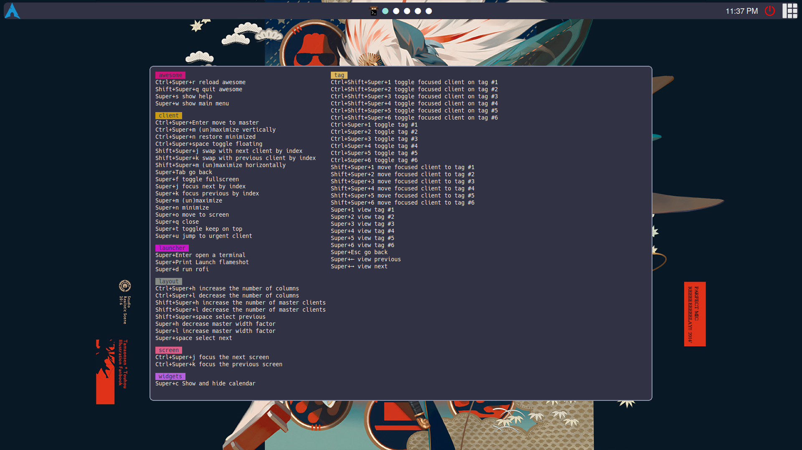

## Mis dotfiles

### Proyecto personal en preparación, se agradece la ayuda



### Detalles

**OS:** Arch Linux
**Shell:** Zsh + Oh My Zsh
**Terminal:** Kitty
**Fuente:** [Hack Nerd Font](https://github.com/ryanoasis/nerd-fonts)
**Paleta de colores** [Catppuccin Theme Mocha](https://catppuccin.com/palette/)

#### Dependencias:

Desde paru (AUR): 

```sh
paru -S awesome-git brave-bin
```

Desde pacman:

```sh
sudo pacman -S xclip flameshot 7zip rofi kitty picom
```

Al descargar la fuente la movemos a `/usr/share/fonts` y se la descomprime `7z x Hack.zip`.

#### Dependencias para zshrc (si se usa Zsh)

[Zsh theme - powerlevel10k](https://github.com/romkatv/powerlevel10k)
[Zsh sudo plugin](https://github.com/ohmyzsh/ohmyzsh/blob/master/plugins/sudo/sudo.plugin.zsh)
[fzf (fuzzy finder)](https://github.com/junegunn/fzfi)

```sh
paru -S zsh-syntax-highlighting zsh-autosuggestions lsd bat scrub fzf
```

### ⚙ Instalación

Primero, clona el repositorio:

```sh
git clone https://github.com/Retxus/dotfiles.git --depth 1
```

Luego podemos crear un link simbólico para los archivos o copiarlos a sus respectivos directorios:

```sh
# Link simbólico

ln -sf ~/dotfiles/config/awesome ~/.config/awesome
ln -sf ~/dotfiles/config/kitty ~/.config/kitty

# Copiar los archivos

cp -r ~/dotfiles/config/awesome ~/.config/awesome
cp -r ~/dotfiles/config/kitty ~/.config/kitty
```
